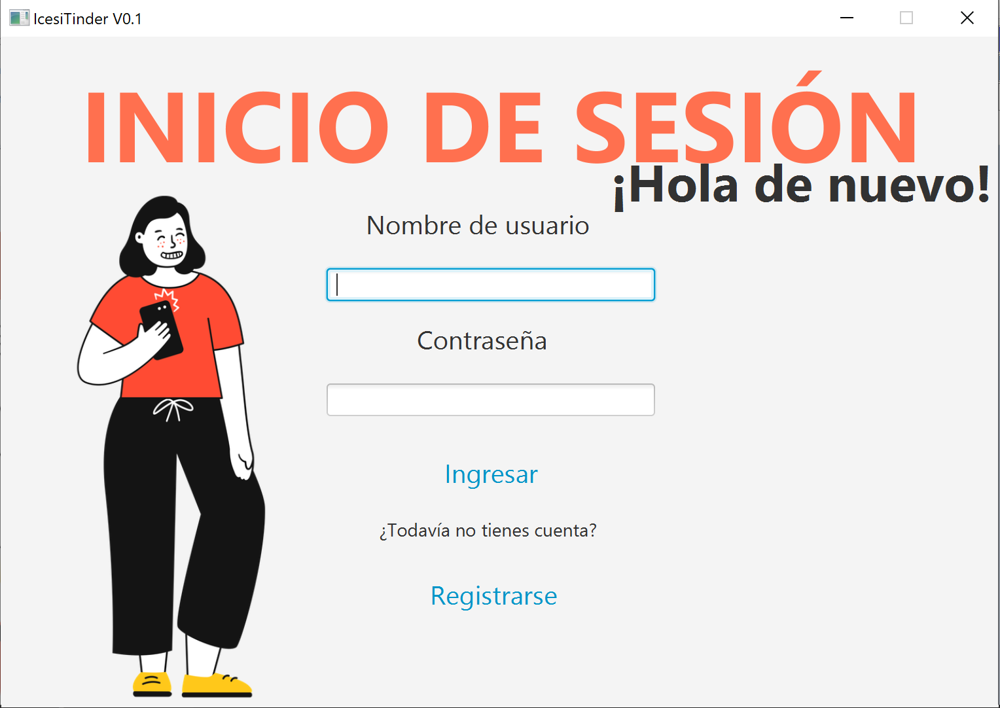
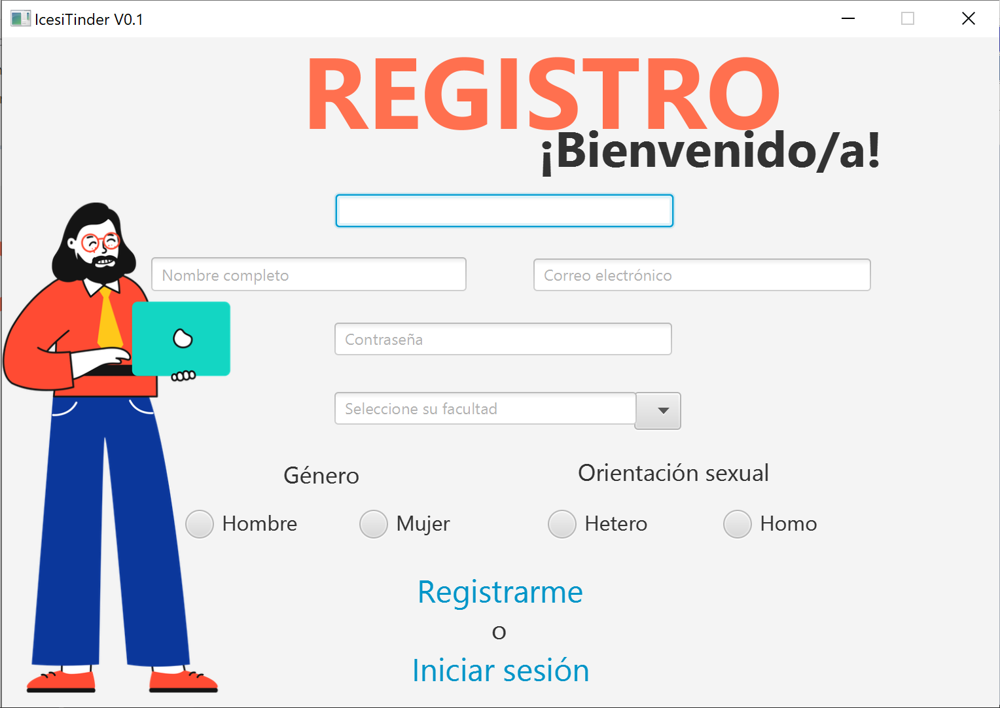

# IcesiTinder

TinderIcesi is a software system which seeks to solve the lack of communication in the university community, where this program allows the creation of a social circle where individuals know each other through someone in common, being able to have a closer relationship where they can see their information and compare things in common among them, all this arose due to the pandemic we are facing right now

## Programming language 🔧
- The language used in this project is Java. 

## Operating system and Development environment 🛠️⚙️
- Linux - Vs Code
- Windows - Eclipse
- Windows - IntelliJ IDEA
- Mac OS - Eclipse

## Documentation

- Documentation [HERE](https://github.com/Dannasofiagarcia/IcesiTinder/docs/DOCUMENTACION)
- Engineering method click [HERE](https://github.com/Dannasofiagarcia/IcesiTinder/docs/Metodo_ingenieria)

## Program pictures

- Main interface 

- Sign in interface

- Sign up interface

- Main user options interface

